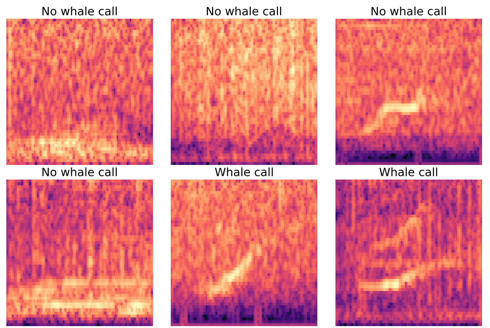
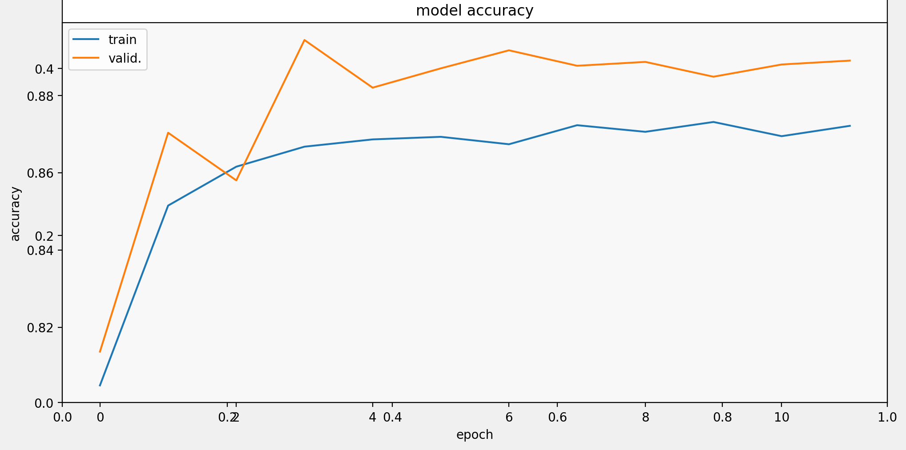

<h1 align="center">🐋 Whale Call Detection and Analysis</h1>

<p align="center">
  
  
  
</p>

---

## 📖 Overview
**Whale Call Detection and Analysis** is a project focused on identifying whale calls from underwater acoustic recordings.  
The goal is to detect, classify, and analyze whale vocalizations to support marine research and environmental monitoring.  
The project demonstrates how **signal processing** and **machine learning** techniques can be used for bioacoustic sound detection.

---

## 🎯 Objectives
- Detect whale call segments from ocean acoustic data.  
- Analyze frequency, duration, and amplitude features of detected calls.  
- Visualize whale calls using spectrograms.  
- Evaluate model performance on real-world marine audio datasets.


---

## 🧩 Technologies Used
- **Python 3.8+**
- **NumPy**, **Pandas**
- **Librosa**, **Matplotlib**, **Seaborn**
- **TensorFlow / PyTorch**
- **Scikit-learn**
- **Jupyter Notebook**

---

## 📊 Sample Output
| Task | Example |
|------|----------|
| Spectrogram of Whale Call |  |
| Model Prediction Plot |  |

---

## 🚀 How to Run
1. Clone the repository:
   ```bash
   git clone https://github.com/<your-username>/Whale-Call-Detection-and-Analysis.git
   cd Whale-Call-Detection-and-Analysis
